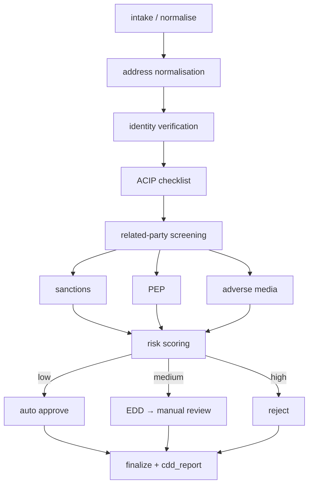

# Agentic Customer Due Diligence with AWS Strands

**Audience:** Developers evaluating or implementing agent-orchestrated CDD/KYC workflows.  
**Documentation:** Published on [GitHub Pages](https://rickydeveloper.github.io/PhoneNumbersPrinter/).  
**Runnable code:** Private repo `agentic-ops`, path `cdd_example/`.  
**Status:** Reference implementation with mock data — not production compliance advice.

---

## 1. What we built

We implemented **Customer Due Diligence (CDD)** as an **agentic workflow** using the **[AWS Strands Agents SDK](https://github.com/strands-agents/sdk-python)**, with the same business logic also runnable via **LangGraph** for comparison.

The design separates three concerns:

| Layer | Responsibility | Where it lives |
|-------|----------------|----------------|
| **Business logic** | KYC checks, ACIP checklist, watchlist screening, risk scoring, decisions, audit trail | `shared/tools.py`, `shared/report.py` |
| **Deterministic orchestration** | Step order, parallelism, branching, case state merge | `shared/pipeline.py`, `template_manager/` |
| **Agent glue (optional)** | LLM chooses tools; does **not** invent screening outcomes | `strands_cdd.py`, `template_orchestrator.py` |

**Key idea:** The LLM is an **orchestrator**, not the compliance engine. Sanctions/PEP/adverse-media matching, ACIP gates, and risk math run in **deterministic Python** inside tools. That keeps runs auditable and reproducible.

---

## 2. Two ways to use Strands in this repo

We deliberately show **two Strands integration patterns** — pick based on how much workflow control you want the model to exercise.

### Pattern A — Single agent, single tool (`strands_cdd.py`)

Best when you want a **minimal agent surface**: one call that runs the full pipeline.

```
User / CLI
    │
    ▼
Strands Agent (Gemini / OpenAI / Bedrock)
    │  calls once
    ▼
execute_full_cdd_workflow  ──►  run_cdd_pipeline(application)
                                    │
                                    ▼
                              full cdd_state + cdd_report
```

- **Entry:** `python -m cdd_example.run --framework strands [--prefer-llm]`
- **Default:** runs `run_cdd_pipeline` directly (no LLM, no API key).
- **With `--prefer-llm`:** agent must call `execute_full_cdd_workflow` exactly once.
- **Modes:** `meta.mode` = `direct` | `single_agent` | `direct_after_agent_error`

### Pattern B — Template orchestrator, multi-tool (`template_orchestrator.py`)

Best when workflows are owned as **Markdown templates** (macro phases + sub-workflows) and the agent **advances the case phase by phase** — closer to how a template manager works in a bank ops team.

```
User / CLI
    │
    ▼
Strands Agent + orchestrator_system_prompt.md
    │
    ├── workflow_get_catalog
    ├── workflow_start_main
    ├── workflow_run_current_subworkflow  (×6 macro phases, or more if routing loops)
    └── workflow_get_status
            │
            ▼
    template_manager  ──►  parses main.md + subworkflows/*.md
            │
            ▼
    handlers (tools.* + mock_apis.*)  ──►  cdd_state
```

- **Entry:** `python -m cdd_example.run_template [--prefer-llm]`
- **Templates:** `templates/cdd_retail_v1/`
- **Modes:** `meta.mode` = `deterministic` | `agent`

Pattern B is what we used to validate **Gemini-driven orchestration** with visible tool traces (`Tool #1 … Tool #9`).

---

## 3. End-to-end CDD pipeline (business steps)

Both patterns execute the same logical CDD spine (ACIP-aligned retail onboarding demo):



**Capabilities included:**

- **Intake & normalisation** — mock CRM load, field cleanup, address standardisation  
- **KYC** — structural identity checks (mock KYC provider stub)  
- **ACIP-style checklist** — blocking + informational record gates (CID / EDD codes)  
- **Related-party screening** — declared parties vs sanctions corpus  
- **Parallel watchlist screening** — sanctions, PEP, adverse media (semantic match)  
- **Risk scoring & routing** — low / medium / high → approve / EDD / reject  
- **Finalisation** — structured `shared/report.py` for case-management handoff  

**LangGraph** expresses each box as a graph node (`langgraph_cdd.py`).  
**Strands Pattern A** runs the sequence inside one Python function (`shared/pipeline.py`).  
**Strands Pattern B** maps each macro phase to a Markdown sub-workflow file.

---

## 4. Markdown template manager (Pattern B detail)

Workflow admins maintain **human- and LLM-readable** Markdown instead of YAML:

| File | Role |
|------|------|
| `templates/cdd_retail_v1/main.md` | Macro phases (`PHASE_1` … `PHASE_6`) and links to sub-workflows |
| `templates/cdd_retail_v1/subworkflows/` | Micro-steps with handler tables |
| `templates/cdd_retail_v1/orchestrator_system_prompt.md` | System prompt: paths, tool order, rules |

Each step declares a **handler** (e.g. `tools.verify_identity`, `mock_apis.load_application`). The template manager parses Markdown → executes handlers → merges into `cdd_state`.

### Conditional routing (decision making)

Templates support **if / else navigation** after a step or macro phase:

```markdown
**Decision routing:**

- if `identity_verified` is false → sub-workflow `subworkflows/91_identity_remediation.md` then step `run_acip_checklist`
- if `acip_summary.blocking_fail_count > 0` is true → sub-workflow `subworkflows/90_rfi_loop.md` then macro `PHASE_2_KYC_ACIP`
- else → macro `PHASE_3_RELATED_PARTIES`
```

| Target syntax | Effect |
|---------------|--------|
| `step \`id\`` | Jump within current sub-workflow |
| `sub-workflow \`path.md\` then step \`id\`` | Run nested sub-workflow, resume at step |
| `sub-workflow \`path.md\` then macro \`PHASE_X\`` | Nested sub-workflow, then jump to macro phase |
| `macro \`PHASE_X\`` | Jump to another macro phase |
| `else → …` | Default branch |

Implemented in `template_manager/routing.py` and `template_manager/conditions.py`.

For mapping RFI / rework loops onto **Strands GraphBuilder** edges, see [`GRAPH_RFI_ROUTING_SPEC.md`](GRAPH_RFI_ROUTING_SPEC.md).

---

## 5. What the LLM does (and does not do)

| LLM **does** | LLM **does not** |
|--------------|------------------|
| Read system prompt + optional template docs | Decide sanctions matches from memory |
| Call Strands tools in policy order | Skip ACIP or screening steps |
| Summarise tool JSON for the user | Mutate `cdd_state` directly |
| Retry on tool errors (model-dependent) | Replace deterministic risk scoring |

All watchlist hits come from `shared/semantic_matcher.py` over bundled JSON corpora (`data/`).

---

## 6. Case state and outputs

**In-memory case object** (`cdd_state`) includes:

- `application`, `normalized`, screening hit lists  
- `identity_verified`, `acip_checks`, `acip_summary`  
- `related_party_hits_by_party`, `risk_score`, `risk_band`, `risk_factors`  
- `decision`, `decision_reason`, `recommended_next_actions`  
- `cdd_report` (schema 1.1), `audit_trail`  

Typed for LangGraph in `shared/state.py` (`CDDState` with list reducers for parallel screening nodes).

**Handoff artifact:** `build_cdd_report(state)` in `shared/report.py` — JSON suitable for case management APIs.

---

## 7. Running locally

### Prerequisites

```bash
cd agentic-ops
python -m venv .venv && source .venv/bin/activate
pip install -r cdd_example/requirements.txt
export PYTHONPATH=$(pwd)
```

### No API key (recommended for CI and logic testing)

```bash
# Full pipeline via template manager
python -m cdd_example.run_template --customer CUST-104

# LangGraph + Strands (direct pipeline) parity
python -m cdd_example.run --customer CUST-101 --framework both
```

### With Gemini (Pattern B agent orchestration)

```bash
pip install 'strands-agents[gemini]'

export GEMINI_API_KEY='your-key'
export CDD_GEMINI_MODEL='gemini-2.5-flash'   # 2.0-flash retired for new keys

# Stable demo routing (avoids HF embedding download)
export CDD_MATCHER=fallback

python -m cdd_example.run_template --customer CUST-104 --prefer-llm
```

**Success indicators:**

- `mode=agent` (not `deterministic`)
- Tool trace: catalog → start → run_current_subworkflow (×6) → status
- `matcher_backend=fallback` when using `CDD_MATCHER=fallback`

### Model provider precedence (Strands)

First match wins in `strands_cdd.py`:

1. `OPENAI_API_KEY` → OpenAI model  
2. `GEMINI_API_KEY` or `GOOGLE_API_KEY` → Gemini (`gemini-2.5-flash` default)  
3. `CDD_USE_STRANDS_BEDROCK=1` → Amazon Bedrock  

**Important:** Call the agent with a **keyword** argument:

```python
agent(task, invocation_state=invocation_state)  # correct
```

### Semantic matcher control

| `CDD_MATCHER` | Behaviour |
|---------------|-----------|
| `auto` (default) | Use `sentence-transformers` if installed, else bigram fallback |
| `fallback` | Always bigram — stable demo outcomes, no Hugging Face download |
| `st` | Require sentence-transformers |

Demo customer **CUST-104** is tuned for **MANUAL_REVIEW** (medium) on `fallback`; with full embeddings, scores can differ (sometimes **REJECTED** / high).

---

## 8. Demo customers

| ID | Scenario | Typical outcome (`CDD_MATCHER=fallback`) |
|----|----------|------------------------------------------|
| CUST-100 | Clean AU retail | APPROVED / low |
| CUST-101 | PEP + jurisdiction | MANUAL_REVIEW / medium |
| CUST-102 | Sanctions name match | REJECTED / high |
| CUST-103 | Adverse media | MANUAL_REVIEW / medium |
| CUST-104 | Related party (Yelena Volkova) | MANUAL_REVIEW / medium |
| CUST-105 | Missing related-party affirmation | RFI → KYC phase re-run |
| CUST-106 | Expired ID | Identity remediation sub-workflow |

---

## 9. Strands vs LangGraph (same logic, different orchestration)

| Concern | AWS Strands | LangGraph |
|---------|-------------|-----------|
| Graph shape | 1 agent + 1 tool **or** 1 agent + 4 workflow tools | ~15 nodes, `StateGraph` |
| Parallel screenings | `ThreadPoolExecutor` in pipeline / template manager | Fan-out edges + list reducers |
| Branching | Python `if` on `risk_band` / template routing rules | `add_conditional_edges` |
| LLM in demo | Optional (tool selection only) | None in graph |
| Best for | Agent-native ops, template-driven orchestration | Explicit graph visualization, checkpointing |

Both call the **same** step functions in `shared/tools.py`.

---

## 10. Repository map (quick reference)

```
cdd_example/
  AGENTIC_CDD_WITH_AWS_STRANDS.md   ← this document
  README.md                         ← quick start + comparison table
  AWS_STRANDS_CDD.md                ← Pattern A (single agent + tool)
  TEMPLATE_MANAGER.md               ← Pattern B (Markdown templates)
  GRAPH_RFI_ROUTING_SPEC.md         ← GraphBuilder / RFI edge mapping

  run.py                            ← LangGraph + Strands Pattern A CLI
  run_template.py                   ← Pattern B CLI
  strands_cdd.py                    ← Strands Pattern A
  template_orchestrator.py          ← Strands Pattern B
  langgraph_cdd.py                  ← LangGraph

  shared/
    pipeline.py                     ← run_cdd_pipeline()
    tools.py                        ← all CDD step functions
    report.py                       ← cdd_report builder
    semantic_matcher.py             ← embeddings + fallback
    state.py                        ← CDDState

  template_manager/                 ← MD parser, routing, mock APIs
  templates/cdd_retail_v1/          ← main.md + subworkflows + system prompt
  data/                             ← mock customers + watchlists
```

---

## 11. Design lessons (for your team)

1. **Keep compliance logic out of the prompt.** Prompts describe *which tools to call*; Python owns *what the answer is*.
2. **Start with deterministic pipeline**, add agent wrapper second — you get tests and parity for free (`run` vs `run_template` without `--prefer-llm`).
3. **Markdown templates** let compliance and engineering share one artifact; the parser gives you executable workflows without asking the LLM to remember step order.
4. **Explicit routing blocks** (`Decision routing:`) model real bank flows: remediation sub-workflows, RFI loops, macro re-entry.
5. **Control embedding backend** in demos (`CDD_MATCHER=fallback`) so onboarding outcomes don’t flip between laptops.
6. **Structured report** (`cdd_report`) is the integration point for case management — not the agent’s chat summary.

---

## 12. Extending the example

| Change | Touch |
|--------|--------|
| New screening rule | `shared/tools.py` |
| Pipeline order / parallelism | `shared/pipeline.py` |
| New macro phase | `main.md` + new `subworkflows/*.md` + orchestrator prompt |
| New external API stub | `template_manager/mock_apis.py` + handler registry |
| Production GraphBuilder graph | [`GRAPH_RFI_ROUTING_SPEC.md`](GRAPH_RFI_ROUTING_SPEC.md) + Strands `GraphBuilder` (future) |

---

## 13. Related reading

- [AWS Strands Agents SDK](https://github.com/strands-agents/sdk-python)  
- `https://strandsagents.com/docs/user-guide/concepts/model-providers/google/`  
- In-repo: [AWS_STRANDS_CDD.md](AWS_STRANDS_CDD.md), [TEMPLATE_MANAGER.md](TEMPLATE_MANAGER.md), [README.md](README.md)

---

*Mock data and illustrative rules only. Adapt handlers, policies, and audit requirements before any production use.*
