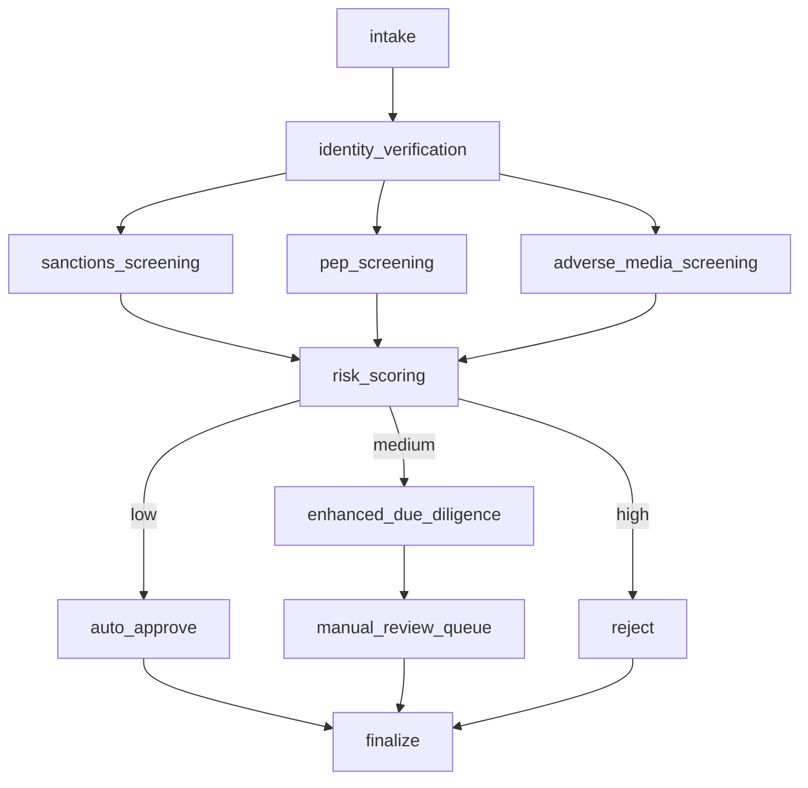

# How the CDD flow works with AWS Strands (single agent)

This describes the **Strands** side of `cdd_example`: **one** Strands `Agent` that delegates the entire Customer Due Diligence (CDD) process to a **single tool** backed by deterministic Python. The logical workflow (intake → parallel screenings → risk → branch → finalize) lives in `shared/pipeline.py`; Strands is optional glue for model-backed runs.

---

## Two operating modes

| Mode | When | What runs |
| --- | --- | --- |
| **Direct** | Default (`prefer_llm=False`), or no API config, or agent failure | `shared/pipeline.py` only — no LLM round-trip. `meta.mode` is `direct`. |
| **Single agent** | `prefer_llm=True` **and** credentials (see below) | One `strands.Agent` with tool `execute_full_cdd_workflow` that **calls the same** `run_cdd_pipeline`. `meta.mode` is `single_agent`. |

Credentials for the agent path (first match wins):

- **`OPENAI_API_KEY`** — Strands `OpenAIModel` (`CDD_OPENAI_MODEL` optional, default `gpt-4o-mini`).  
- **`GEMINI_API_KEY`** or **`GOOGLE_API_KEY`** — Strands `GeminiModel` (`CDD_GEMINI_MODEL` optional, default `gemini-2.5-flash`). Requires `pip install 'strands-agents[gemini]'`.  
- **`CDD_USE_STRANDS_BEDROCK=1`** (with your normal AWS/Bedrock setup) — `BedrockModel` (`CDD_BEDROCK_MODEL_ID` optional).

Without those, `--prefer-llm` logs a warning and falls back to **direct** pipeline execution.

---

## Logical workflow (same for Strands and LangGraph)

The business steps are unchanged; only **orchestration** differs from LangGraph:



Implementation detail: `run_cdd_pipeline` runs the three screenings **concurrently** (`ThreadPoolExecutor`) after identity verification, then merges results, scores risk, branches, and finalizes — matching the diagram’s intent.

---

## What the Strands `Agent` actually does

1. **Construction** (`strands_cdd.py`): `Agent(name="cdd_orchestrator", model=..., tools=[execute_full_cdd_workflow], ...)`.
2. **`execute_full_cdd_workflow` tool**: reads `invocation_state["application"]`, calls `run_cdd_pipeline(application)`, stores the full case dict on `invocation_state["cdd_state"]`, returns a short JSON summary (`decision`, `risk_band`, etc.) for the model to echo.
3. **User message**: instructs the model to call that tool **exactly once**.
4. **`run()`**: after `agent(task, invocation_state)`, copies `cdd_state` and sets `meta.execution_order` via `execution_order_for_band` for CLI parity with LangGraph-style step lists.

The **LLM does not implement KYC or list matching** — it only triggers the tool (when you use agent mode). All screening uses `shared/semantic_matcher.py` inside the tool.

---

## LangGraph vs Strands in this repo

| Aspect | Strands (`strands_cdd.py`) | LangGraph (`langgraph_cdd.py`) |
| --- | --- | --- |
| Shape | 1 `Agent`, 1 tool | Many nodes, `StateGraph` |
| Parallel join | `ThreadPoolExecutor` inside `run_cdd_pipeline` | Native super-step + list reducers on `CDDState` |
| Branching | Plain `if` on `risk_band` in Python after `score_risk` | `add_conditional_edges` |
| Shared state | Full case dict built inside pipeline; optional `invocation_state` for agent | `CDDState` channel |

---

## Running and extending

```bash
pip install -r cdd_example/requirements.txt
# Direct pipeline (default for Strands path)
python -m cdd_example.run --framework strands --customer CUST-101
# Optional single Agent + tool — OpenAI, Gemini, or Bedrock (see above)
pip install 'strands-agents[gemini]'   # only if using Gemini
export GEMINI_API_KEY=...
python -m cdd_example.run --framework strands --prefer-llm --customer CUST-101
```

To change behaviour, edit `shared/tools.py` (per-step logic) and/or `shared/pipeline.py` (order, parallelism, branching). Strands wiring stays a thin shell around `run_cdd_pipeline`.

---

## Disclaimer

Mock data and demo rules only — not production compliance advice.
