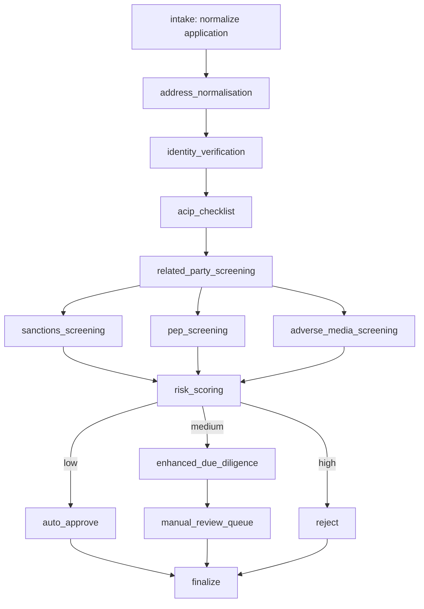

# CDD Example: AWS Strands vs LangGraph

A self-contained Customer Due Diligence (CDD) workflow implemented twice —
once with the **AWS Strands Agents SDK** (a **single `Agent`** plus one tool,
or a direct Python pipeline) and once with **LangGraph** (one graph node per
step) — against the same mock data and the same Python functions in
`shared/tools.py` and `shared/pipeline.py`.
The two implementations live side by side so you can compare orchestration
styles: sequential steps, parallel screening, and decision-based routing.
Sanctions / PEP / adverse-media screening uses **semantic matching** powered
by `sentence-transformers` (with a character-bigram fallback when the model
isn't available).

For **how Strands is wired** (single `Agent` + one tool vs direct pipeline),
see [AWS_STRANDS_CDD.md](AWS_STRANDS_CDD.md).

For a **shareable developer overview** of the full agentic CDD + Strands work,
see [AGENTIC_CDD_WITH_AWS_STRANDS.md](AGENTIC_CDD_WITH_AWS_STRANDS.md).

For **template-by-template orchestration** (macro workflow Markdown + sub-workflows +
orchestrator system prompt + mock APIs), see [TEMPLATE_MANAGER.md](TEMPLATE_MANAGER.md).

```bash
PYTHONPATH=. python -m cdd_example.run_template --customer CUST-102
PYTHONPATH=. python -m cdd_example.run_template --show-prompt   # orchestrator system prompt
```

## Workflow



Patterns demonstrated:

| Pattern | Where it appears |
| --- | --- |
| Sequential | `intake -> address_normalisation -> identity_verification -> acip_checklist -> related_party_screening`; `enhanced_due_diligence -> manual_review_queue`; `* -> finalize` |
| Parallel fan-out / fan-in | `related_party_screening -> {sanctions, pep, adverse_media} -> risk_scoring` |
| Decision-based routing | `risk_scoring -> {auto_approve, enhanced_due_diligence, reject}` |
| Semantic matching | `shared/semantic_matcher.py` invoked by each screening step |
| Structured handoff | `finalize_case` emits `cdd_report` (see `shared/report.py`); CLI `--cdd-report-json` |

## Layout

```
cdd_example/
  README.md
  AWS_STRANDS_CDD.md     # Strands-only architecture guide
  requirements.txt
  run.py                      # CLI runner
  data/
    customers.json            # 5 mock applicants (low/medium/high + related-party)
    sanctions_list.json       # mock OFAC/UN/EU/UK/AU sanctions records
    pep_list.json             # mock politically exposed persons
    adverse_media.json        # mock adverse-media articles
  shared/
    state.py                  # CDDState TypedDict with reducer-typed fields
    tools.py                  # normalize / address / ACIP / related-party / screen / score / decide / finalize
    report.py                 # build_cdd_report() for case-file / API handoff
    semantic_matcher.py       # sentence-transformers + cosine similarity (with fallback)
    pipeline.py               # deterministic run_cdd_pipeline (used by Strands tool + parity)
  strands_cdd.py              # AWS Strands: single Agent + one tool (or direct pipeline)
  langgraph_cdd.py            # LangGraph StateGraph implementation
```

## Run it

```bash
pip install -r cdd_example/requirements.txt

python -m cdd_example.run --list                   # see the bundled customers
python -m cdd_example.run --customer CUST-100      # low risk  -> APPROVED
python -m cdd_example.run --customer CUST-101      # medium    -> MANUAL_REVIEW (PEP + adverse media)
python -m cdd_example.run --customer CUST-102      # high      -> REJECTED (sanctions hit)
python -m cdd_example.run --customer CUST-103      # medium    -> MANUAL_REVIEW (adverse media)
python -m cdd_example.run --customer CUST-104      # medium    -> MANUAL_REVIEW (related-party vs sanctions corpus)

python -m cdd_example.run --customer CUST-104 --cdd-report-json   # emit structured JSON report after run

python -m cdd_example.run --customer CUST-101 --framework strands
python -m cdd_example.run --customer CUST-101 --framework langgraph
```

By default the runner executes both engines back-to-back so you can confirm
they produce the same decision and audit trail for the same input.

## Mock customers

| ID | Name | Expected branch | Why |
| --- | --- | --- | --- |
| `CUST-100` | Sarah Chen | low -> auto-approve | clean across all watch lists |
| `CUST-101` | Vladimir Petrof | medium -> EDD -> manual review | semantic match to PEP "Vladimir Petrov" + adverse media |
| `CUST-102` | Ahmed al-Sayed | high -> reject | strong sanctions match (OFAC SDN) |
| `CUST-103` | John Doe | medium -> EDD -> manual review | adverse media match (alleged crypto fraud) |
| `CUST-104` | Emma Walsh | medium -> EDD -> manual review | related-party name matches sanctions corpus (principal screens clean) |

## Strands vs LangGraph: how the same patterns are expressed

| Concern | AWS Strands (`strands_cdd.py`) | LangGraph (`langgraph_cdd.py`) |
| --- | --- | --- |
| Orchestration | **One** `Agent` + tool `execute_full_cdd_workflow`, **or** call `shared/pipeline.py` directly (default) | One node per step in a `StateGraph` |
| Sequential steps | Inside `run_cdd_pipeline` (normalize → verify → …) | Explicit edges between nodes |
| Parallel screenings | `ThreadPoolExecutor` inside `run_cdd_pipeline` | Three edges from `related_party_screening`; LangGraph merges list fields with reducers |
| Decision routing | Python `if` on `risk_band` after `score_risk` in `run_cdd_pipeline` | `add_conditional_edges("risk_scoring", _route_by_risk, {...})` |
| Case state | Full dict built by `run_cdd_pipeline`; optional `invocation_state` when using the Agent | Typed `CDDState` channel |
| LLM role | Optional: model only invokes the tool once when `--prefer-llm` and API keys are set | No LLM in the example graph |
| Persistence / replay | Not used here | `compile(checkpointer=InMemorySaver())` |

## Semantic matching

Each screening step calls
`shared/semantic_matcher.py``.match(query, corpus, ...)`.
The matcher embeds the watch-list entries and the applicant query with
`sentence-transformers/all-MiniLM-L6-v2` and ranks them by cosine
similarity. This is what lets `Vladimir Petrof` match the PEP record for
`Vladimir Petrov`, and what catches "Ahmed al-Sayed" against
"Ahmed Al Sayed" / "Ahmad El-Sayyid" aliases on the sanctions list.

If `sentence-transformers` is not installed, the matcher transparently
falls back to character-bigram cosine similarity so the example still runs
end to end. The bundled customers are tuned to be routed correctly under
either backend.

Force the backend with **`CDD_MATCHER`**:

- `auto` (default) — use sentence-transformers when installed, else fallback
- `fallback` — always bigram (stable demo routing, no HF download)
- `st` — require sentence-transformers

## Optional Strands LLM wrapper

By default the Strands path runs **`run_cdd_pipeline` directly** (no model
tokens). To exercise a **single** Strands `Agent` that calls one tool wrapping
the same pipeline, set a model key (see below) and pass `--prefer-llm`:

```bash
# OpenAI
export OPENAI_API_KEY=...
python -m cdd_example.run --customer CUST-101 --framework strands --prefer-llm

# Google Gemini (install extra: pip install 'strands-agents[gemini]')
export GEMINI_API_KEY=...   # or GOOGLE_API_KEY
# optional: export CDD_GEMINI_MODEL=gemini-2.5-flash
python -m cdd_example.run --customer CUST-101 --framework strands --prefer-llm
```

The CDD logic stays in Python inside the tool; the model’s job is to call
`execute_full_cdd_workflow` once. See `strands_cdd.py`.
