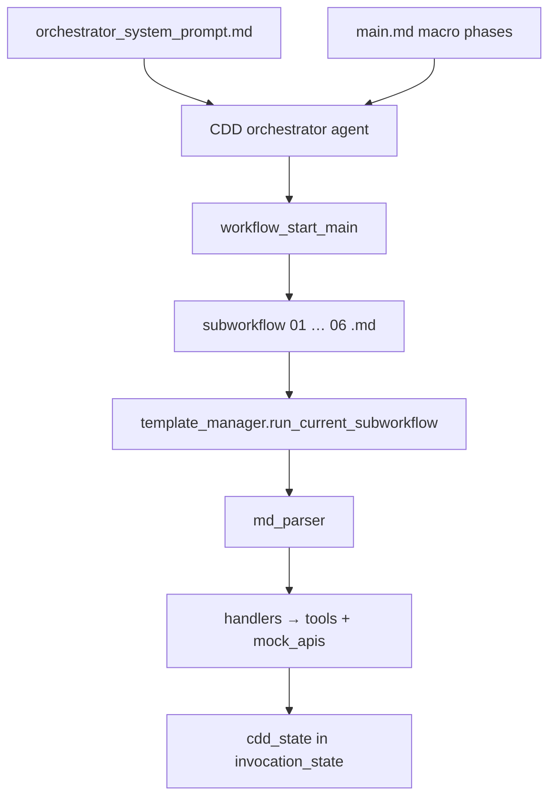

# Template-manager CDD architecture

This folder implements **template-by-template** CDD orchestration for organisations that want:

- a **main (macro) workflow** Markdown doc owned by workflow admins;
- **sub-workflow** Markdown files per phase (intake, KYC, screening, decision, finalize);
- an **orchestrator agent** whose **system prompt** embeds macro step order and **file paths**;
- **mock APIs** standing in for CRM / KYC / watchlist services.

Templates are **Markdown-first** so humans and LLMs can read purpose, order, and handler tables directly. The template manager parses the same `.md` files to execute steps deterministically (no YAML required).

Business logic still lives in `cdd_example/shared/tools.py`. Templates only declare **which handler runs when**.

---

## Layout

```
cdd_example/templates/cdd_retail_v1/
  main.md                            # macro phases → sub-workflow paths
  orchestrator_system_prompt.md      # agent system prompt (paths + tool rules)
  subworkflows/
    01_intake_normalisation.md
    02_kyc_acip.md
    03_related_parties.md
    04_watchlist_screening.md        # parallel groups
    05_risk_decision.md              # branch table
    06_finalize.md
    90_rfi_loop.md                   # reference / extension

cdd_example/template_manager/
  manager.py                         # load MD, advance macro cursor, execute steps
  md_parser.py                       # Markdown → executor dict
  handlers.py                        # handler string → Python callable
  mock_apis.py                       # mock CRM / KYC / list APIs

cdd_example/template_orchestrator.py # Strands agent + tools OR deterministic runner
cdd_example/run_template.py          # CLI
```

---

## Markdown template conventions

### Main workflow (`main.md`)

- Metadata lines: `**Workflow id:**`, `**Start sub-workflow:**`
- `## Macro phases` with `### PHASE_N_ID — Label` sections
- Each phase: `**Sub-workflow:**`, `**Next phase:**`, `**Outputs:**`

### Sub-workflow (`subworkflows/*.md`)

- `## Purpose` — narrative for LLM / compliance reviewers
- `## Sequential steps` — `### step_id — label` + handler table
- `## Parallel groups` — `### group_id *(parallel)*` + `#### step_id` children

Handler table keys (case-insensitive):

| Key | Example |
|-----|---------|
| handler | `tools.verify_identity` |
| mock API | `mock_apis.kyc_document_verify` |
| writes | `identity_verified`, `audit_trail` |
| branch on | `cdd_state.risk_band` |

**Decision routing** (after a step or macro phase):

```markdown
**Decision routing:**

- if `identity_verified` is false → sub-workflow `subworkflows/91_identity_remediation.md` then step `run_acip_checklist`
- if `acip_summary.blocking_fail_count > 0` is true → sub-workflow `subworkflows/90_rfi_loop.md` then macro `PHASE_2_KYC_ACIP`
- else → macro `PHASE_3_RELATED_PARTIES`
```

| Target | Meaning |
|--------|---------|
| `step \`id\`` | Jump within same sub-workflow |
| `sub-workflow \`file.md\` then step \`id\`` | Run nested sub-workflow, resume at step |
| `sub-workflow \`file.md\` then macro \`PHASE_X\`` | Nested sub-workflow, then macro phase |
| `macro \`PHASE_X\`` | Jump to macro phase |

Conditions are evaluated against `cdd_state` (supports `==`, `!=`, `>`, `<`, bare booleans). Implemented in `template_manager/conditions.py` and `routing.py`.

Branch routes (handler dispatch) use bullet lines: ``- `low` → `tools.auto_approve` ``

---

## Execution model



1. Agent reads **system prompt** and may read linked **Markdown** templates for context.
2. **`workflow_start_main`** loads `main.md`, sets cursor to `PHASE_1_INTAKE`.
3. For each macro phase, **`workflow_run_current_subworkflow`** parses the linked `.md`, runs every step (or parallel group), merges into `cdd_state`, advances cursor.
4. After phase 6, `cdd_report` is available for case management export.

---

## Handler strings in sub-workflows

| Prefix | Example | Meaning |
|--------|---------|---------|
| `mock_apis.*` | `mock_apis.load_application` | Fixture-backed external API stub |
| `tools.*` | `tools.verify_identity` | Deterministic CDD step (`shared/tools.py`) |
| `template_manager.*` | `template_manager.route_by_risk_band` | Template routing helper |

Optional **mock API** rows in the handler table are called immediately before the main handler (audit + latency simulation).

---

## Run locally (no LLM)

```bash
cd /path/to/agentic-ops
pip install -r cdd_example/requirements.txt
export PYTHONPATH=.

python -m cdd_example.run_template --customer CUST-102
python -m cdd_example.run_template --show-catalog
python -m cdd_example.run_template --show-prompt
```

## Run with orchestrator agent (Gemini / OpenAI)

```bash
pip install 'strands-agents[gemini]'
export GEMINI_API_KEY=...
export PYTHONPATH=.

python -m cdd_example.run_template --customer CUST-104 --prefer-llm
```

The agent follows `orchestrator_system_prompt.md`: catalog → start → six × `run_current_subworkflow` → status.

---

## Adding a new macro phase

1. Add `subworkflows/NN_my_phase.md` with Purpose + Sequential steps (and Parallel groups if needed).
2. Append a `### PHASE_N_...` section in `main.md` with sub-workflow link and next phase.
3. Update `orchestrator_system_prompt.md` macro list.
4. Register any new handler in `template_manager/handlers.py` if needed.

---

## RFI / rework

See `subworkflows/90_rfi_loop.md` and [`GRAPH_RFI_ROUTING_SPEC.md`](GRAPH_RFI_ROUTING_SPEC.md) for wiring RFI triggers back to KYC in a GraphBuilder deployment. The template manager demo runs the happy-path spine only.
